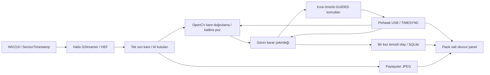

# Görev 2 quad test mimarisi

Karar tarihi: 5 Eylül 2026. Bu tasarım yeni proje için yazıldı; eski uygulama kodları alınmadı. Kullanıcının `detection.py` dosyası Hailo entegrasyonunun referansıdır.

## Veri ve kontrol ayrımı

Kamera yakalama ve Hailo çıkarımı sürekli çalışır. Picamera2 sensör zaman damgası kullanılır; kare sayısından uydurulan zaman damgası kullanılmaz. Hailo callback'i `hailo.get_roi_from_buffer` ve `HAILO_DETECTION` ile AI sonuçlarını alır. Tek yuvalı bellek eski kare kuyruğunu önler. CPU üzerinde ikinci bir AI çıkarım yolu yoktur.

GStreamerDetectionApp'in Hailo çıkarım yardımcıları korunur; kamera kaynağı, başsız çalışma ve zaman damgası yönetimi uyarlanır. Referans paket sürümündeki otomatik yatay aynalama kaldırılır. Tracker çıktısı kullanılmaz; tahmin edilerek yaşatılmış kutu bağımsız tespit sayılamaz. `hailonet` batch boyutu 1 ve HEF dosyası başlangıçta denetlenir.

Hailo'nun TAPPAS `HailoNMSDecode` kodu HEF sınıf indeksine `+1` ekler. Bu yüzden model üst verisindeki `0=kirmizi_hedef, 1=mavi_hedef` ile callback'teki `1=kirmizi_hedef, 2=mavi_hedef` farklı katmanlardır. `config/hailo_labels.json` başına `unlabeled` eklenmesi bu davranış içindir. Callback hem sınıf kimliğini hem etiketi denetler. Bu eşlemenin gerçek görüntülerle cihazda doğrulanması ayrıca gerekir.

AI mavi tespiti ilk kapıdır. OpenCV yalnız bu ROI içinde adaptif mavi kontrastı, kenar, dört köşe, dışbükeylik, kutu örtüşmesi, kadraj sınırı ve poz makullüğü kontrolü yapar. Katı HSV aralığı birincil dedektör değildir. Kare boyutu, kalibrasyon ve dört köşe ile PnP çözülür. IPPE ve planar ITERATIVE adayları reprojeksiyon/poz belirsizliği ve yatay hedef düzlemiyle kontrol edilir.

Kamera optik eksenleri, kullanıcının aşağı bakan montajına göre FRD'ye çevrilir. Çekim anındaki roll/pitch/yaw ve lens ofseti eklenir; hedef NED yerel konuma taşınır. MAVLink hızının BODY çerçevesi başlığa göredir; roll/pitch bu hız eksenlerine yanlışlıkla uygulanmaz. `GLOBAL_POSITION_INT.relative_alt` yalnız HOME'a göre irtifa olarak kullanılır.

## Eşzamanlılık

- Kamera/Hailo: yakalama ve NPU çıkarımı; callback yalnız veri aktarır.
- Vision işçisi: OpenCV ve metrik geometri.
- MAVLink işçisi: bağlantının tek okuyucusu/yazıcısı; RC müdahalesini kontrol döngüsünü beklemeden görür.
- Karar döngüsü: ağ/disk işlemi yapmadan 20 Hz karar üretir.
- Olay yazıcısı: temsili bırakmayı diske atomik kaydeder; doğrulamadan inişe dönüş başlatılmaz.
- JPEG işçisi ve Flask: uçuş döngüsünden bağımsız, ortak son görüntü.

Bağlantı işçisinin hız komutlarına 0,25 s kullanım süresi vardır. Uygulama canlı olsa da karar döngüsü takılırsa eski komut sonsuza kadar yenilenmez. Tam Pi/USB arızasında yalnız Pi yazılımıyla emniyet sağlanamaz; gerçek ArduCopter parametreleri ve alıcı kayıp davranışı test edilmelidir.

## Devir ve temsili bırakma

Program yalnız uçuş öncesinde DISARM görmüşse, AUTO TAKEOFF tamamlanmışsa ve aktif madde tarama waypoint'i ise GUIDED isteyebilir. RC anahtarının AUTO konumu izlenir. Loiter seçimi veya beklenmedik mod değişimi tekrar devralmayı kilitler; pilot komutuna karşı GUIDED gönderilmez.

Merkezleme kilidi, alçalma ve bırakma kilidi ayrı koşullardır. Aynı kareyi tekrar okumak süre kazandırmaz; kararsızlık süreyi sıfırlar. Kayıp hedefte hız sıfırlanır, belirlenen süre sonunda Loiter'a bırakılır. Zaman aşımından sonra bırakma yoktur.

Temsili bırakma SQLite'a tek kez yazılır. Servo/MAVLink PWM komutu implementasyonu bulunmaz. Dönüş önce kaydedilmiş arama irtifasına çıkış, sonra son LAND koordinatına yatay geçiştir. Önceden yüklenmiş mission içeriği değiştirilmez. Yalnız son madde seçilir; `MISSION_CURRENT` doğrulanmadan AUTO istenmez. `MIS_RESTART=0` kontrolü görevin baştan başlamasını önlemek içindir.

## Birincil kaynaklar

- Kullanıcının bu projedeki `detection.py` dosyası ve `safak_v2_hailo_model/metadata.yaml`.
- [Hailo referans Detection pipeline; incelenen sabit commit](https://github.com/hailo-ai/hailo-apps/blob/10eb857696935f2aa82133afe066c2756f4fe73e/hailo_apps/hailo_app_python/apps/detection/detection_pipeline.py).
- [TAPPAS HailoNMSDecode](https://github.com/hailo-ai/tappas/blob/master/core/hailo/libs/postprocesses/detection/hailo_nms_decode.hpp).
- [OpenCV PnP](https://docs.opencv.org/4.x/d5/d1f/calib3d_solvePnP.html).
- [ArduCopter GUIDED komutları](https://ardupilot.org/dev/docs/copter-commands-in-guided-mode.html).
- [ArduCopter AUTO](https://ardupilot.org/copter/docs/auto-mode.html).
- [ArduPilot irtifa tanımları](https://ardupilot.org/copter/docs/common-understanding-altitude.html).
- [MAVLink mission protokolü](https://mavlink.io/en/services/mission.html).

Bağlantılı dokümanlar tasarım referanslarıdır; yerel kod yeni bir uygulamadır. Kaynak incelemesi, fiziksel Hailo/F450 doğrulaması değildir.
